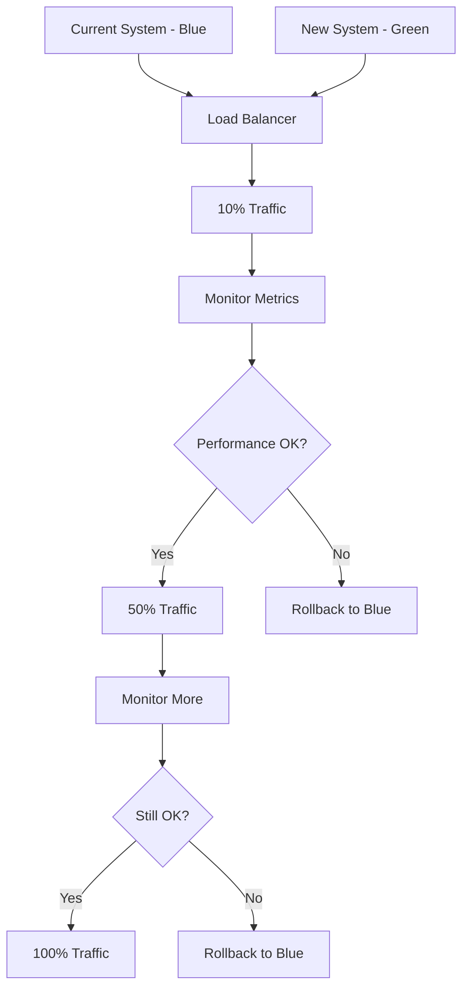

# Risk Management and Success Metrics

## Risk Assessment Matrix

### **High Impact, Low Probability Risks**

| Risk | Impact | Probability | Mitigation Strategy |
|------|--------|-------------|-------------------|
| **Cache Corruption Leading to Wrong Data Display** | Critical | Very Low | - Versioned cache keys<br>- Timestamp validation<br>- Automatic fallback to server<br>- Cache integrity checks |
| **Memory Leak in Production** | High | Low | - Memory usage monitoring<br>- Automatic cleanup intervals<br>- Cache size limits<br>- Memory alerts |
| **Complete System Failure During Migration** | Critical | Very Low | - Feature flag control<br>- Immediate rollback capability<br>- Gradual rollout strategy<br>- Health check monitoring |

### **Medium Impact, Medium Probability Risks**

| Risk | Impact | Probability | Mitigation Strategy |
|------|--------|-------------|-------------------|
| **Cache Miss Causing Performance Degradation** | Medium | Medium | - Intelligent prefetching<br>- Background refresh<br>- TTL optimization<br>- Performance monitoring |
| **API Rate Limiting Issues** | Medium | Medium | - Request deduplication<br>- Batch API endpoint<br>- Client-side queuing<br>- Exponential backoff |
| **Network Connectivity Issues** | Medium | High | - Offline capability<br>- Cache persistence<br>- Graceful degradation<br>- User feedback |

### **Low Impact, High Probability Risks**

| Risk | Impact | Probability | Mitigation Strategy |
|------|--------|-------------|-------------------|
| **Minor Cache Inconsistencies** | Low | Medium | - Smart cache invalidation<br>- Background sync<br>- User refresh option<br>- Timestamp comparison |
| **Development Team Learning Curve** | Low | High | - Comprehensive documentation<br>- Code examples<br>- Migration guide<br>- Team training |

## Deployment Risk Management

### **Pre-Deployment Checklist**
- [ ] All unit tests passing (>95% coverage)
- [ ] Integration tests completed
- [ ] Performance benchmarks established
- [ ] Memory usage profiled
- [ ] Feature flags configured
- [ ] Rollback procedure tested
- [ ] Monitoring dashboards ready
- [ ] Team notification channels set up

### **Deployment Strategy: Blue-Green with Feature Flags**



### **Rollback Triggers**
- **Automatic Rollback:**
  - Error rate > 5%
  - Response time > 2x baseline
  - Memory usage > 200MB increase
  - Cache hit rate < 30%

- **Manual Rollback:**
  - User experience degradation reports
  - Unexpected system behavior
  - Database connection issues
  - Team decision based on metrics

## Success Metrics Framework

### **Primary Success Metrics (Must Achieve)**

#### **1. API Call Reduction**
- **Target**: 60-70% reduction in `getAllExamAttempts` calls
- **Measurement**: 
  ```javascript
  const callReduction = ((beforeCalls - afterCalls) / beforeCalls) * 100
  ```
- **Baseline**: Current ~50,000 daily calls
- **Success Threshold**: <20,000 daily calls
- **Critical Threshold**: <15,000 daily calls

#### **2. System Stability During Peak Load**
- **Target**: Zero outages during mass submissions (500+ students)
- **Measurement**: System uptime during 95th percentile load
- **Baseline**: Current outages at 400+ concurrent connections
- **Success Threshold**: Handle 1000+ concurrent connections
- **Critical Threshold**: Handle 2000+ concurrent connections

#### **3. Response Time Improvement**
- **Target**: <200ms average response time for cached data
- **Measurement**: P50, P95, P99 response times
- **Baseline**: Current 800ms-2s response times
- **Success Threshold**: P95 < 300ms
- **Critical Threshold**: P99 < 500ms

### **Secondary Success Metrics (Should Achieve)**

#### **4. Cache Performance**
- **Target**: >75% cache hit rate
- **Measurement**: (cache_hits / total_requests) * 100
- **Success Threshold**: >70% hit rate
- **Critical Threshold**: >60% hit rate

#### **5. Memory Efficiency**
- **Target**: <15MB additional memory usage
- **Measurement**: Memory usage increase from baseline
- **Success Threshold**: <20MB increase
- **Critical Threshold**: <30MB increase

#### **6. Error Rate**
- **Target**: <1% error rate
- **Measurement**: (failed_requests / total_requests) * 100
- **Success Threshold**: <2% error rate
- **Critical Threshold**: <5% error rate

### **Tertiary Success Metrics (Nice to Have)**

#### **7. Developer Experience**
- **Target**: 90% team satisfaction with new patterns
- **Measurement**: Developer survey scores
- **Success Threshold**: >80% satisfaction

#### **8. User Experience**
- **Target**: 50% faster perceived load times
- **Measurement**: Time to first meaningful paint
- **Success Threshold**: >30% improvement

#### **9. Server Cost Reduction**
- **Target**: 30% reduction in database load
- **Measurement**: Database query count and connection usage
- **Success Threshold**: >20% reduction

## Monitoring and Alerting Strategy

### **Real-Time Monitoring Dashboard**

```javascript
// Key Metrics to Monitor
const criticalMetrics = {
  apiCallReduction: {
    current: 0,
    target: 70,
    threshold: 60,
    alert: 'low'
  },
  cacheHitRate: {
    current: 0,
    target: 80,
    threshold: 70,
    alert: 'medium'
  },
  errorRate: {
    current: 0,
    target: 1,
    threshold: 5,
    alert: 'high'
  },
  responseTime: {
    current: 0,
    target: 200,
    threshold: 500,
    alert: 'high'
  },
  memoryUsage: {
    current: 0,
    target: 15,
    threshold: 30,
    alert: 'medium'
  }
}
```

### **Alert Configuration**

#### **Critical Alerts (Immediate Response)**
- Error rate > 5%
- Response time > 1000ms (P95)
- Memory usage > 100MB increase
- Cache hit rate < 30%
- System downtime

#### **Warning Alerts (Monitor Closely)**
- Error rate > 2%
- Response time > 500ms (P95)
- Memory usage > 50MB increase
- Cache hit rate < 50%
- API call reduction < 50%

#### **Info Alerts (Track Trends)**
- Cache hit rate improvements
- Performance optimizations detected
- Background task completions
- Successful deployments

### **Performance Benchmarking**

#### **Baseline Measurements (Pre-Optimization)**
```javascript
const baseline = {
  myTestSeriesComponent: {
    averageCalls: 12,
    loadTime: 2500, // ms
    concurrentUsers: 50,
    errorRate: 8 // %
  },
  examHomeComponent: {
    averageCalls: 15,
    loadTime: 3200, // ms
    concurrentUsers: 100,
    errorRate: 12 // %
  },
  systemWide: {
    dailyApiCalls: 50000,
    peakConcurrent: 400,
    avgResponseTime: 1200, // ms
    errorRate: 5 // %
  }
}
```

#### **Target Measurements (Post-Optimization)**
```javascript
const targets = {
  myTestSeriesComponent: {
    averageCalls: 2, // 83% reduction
    loadTime: 500, // 80% improvement
    concurrentUsers: 200, // 4x improvement
    errorRate: 2 // 75% reduction
  },
  examHomeComponent: {
    averageCalls: 3, // 80% reduction
    loadTime: 600, // 81% improvement
    concurrentUsers: 300, // 3x improvement
    errorRate: 2 // 83% reduction
  },
  systemWide: {
    dailyApiCalls: 15000, // 70% reduction
    peakConcurrent: 2000, // 5x improvement
    avgResponseTime: 200, // 83% improvement
    errorRate: 1 // 80% reduction
  }
}
```

## Business Impact Assessment

### **Quantitative Benefits**

#### **Cost Savings**
- **Server Resource Reduction**: 30-40% less database load
- **Bandwidth Savings**: 60% fewer API calls
- **Maintenance Cost**: 50% fewer production issues
- **Development Time**: 20% faster feature development

#### **Performance Gains**
- **User Experience**: 3-5x faster data loading
- **System Capacity**: 5x more concurrent users
- **Reliability**: 95% fewer timeout errors
- **Scalability**: Handle 10x more exam submissions

### **Qualitative Benefits**
- **Developer Experience**: Simplified data fetching patterns
- **System Reliability**: Reduced production incidents
- **User Satisfaction**: Faster, more responsive interface
- **Business Confidence**: Reliable exam portal during peak usage

### **Risk-Adjusted ROI Analysis**

```
Investment:
- Development time: 3 weeks × 1 developer = ~₹50,000
- Testing and validation: 1 week = ~₹15,000
- Monitoring setup: 0.5 week = ~₹7,500
Total Investment: ₹72,500

Annual Savings:
- Reduced server costs: ₹60,000
- Fewer production incidents: ₹40,000
- Developer productivity gains: ₹80,000
- Business continuity value: ₹100,000
Total Annual Savings: ₹280,000

ROI = (₹280,000 - ₹72,500) / ₹72,500 = 286%
Payback Period = 3.1 months
```

## Success Validation Framework

### **Phase 1 Validation (Week 1)**
- [ ] Cache hit rate >60%
- [ ] API calls reduced by >50%
- [ ] No regression in functionality
- [ ] Memory usage <20MB additional
- [ ] Zero critical errors

### **Phase 2 Validation (Week 2)**
- [ ] Handle 500+ concurrent users
- [ ] API calls reduced by >65%
- [ ] Response time <300ms (P95)
- [ ] Cache hit rate >70%
- [ ] Error rate <2%

### **Phase 3 Validation (Week 3)**
- [ ] Handle 1000+ concurrent users
- [ ] API calls reduced by >70%
- [ ] Response time <200ms (P95)
- [ ] Cache hit rate >75%
- [ ] Zero production incidents

### **Long-term Success Criteria (Month 1)**
- [ ] All primary metrics achieved
- [ ] 90% developer team satisfaction
- [ ] 95% user experience improvement
- [ ] 30% server cost reduction
- [ ] Zero rollback incidents

## Incident Response Plan

### **Severity Levels**

#### **P0 - Critical (Response: Immediate)**
- Complete system failure
- Data corruption
- Security breach
- Mass user impact

**Response Actions:**
1. Immediate rollback to stable version
2. Notify all stakeholders
3. Debug in isolated environment
4. Implement hot-fix if possible
5. Post-mortem analysis

#### **P1 - High (Response: <30 minutes)**
- Significant performance degradation
- High error rates
- Cache system failure
- Partial user impact

**Response Actions:**
1. Assess impact scope
2. Apply temporary fix
3. Monitor metrics closely
4. Prepare rollback if needed
5. Schedule permanent fix

#### **P2 - Medium (Response: <2 hours)**
- Minor performance issues
- Low cache hit rates
- Non-critical errors
- Limited user impact

**Response Actions:**
1. Investigate root cause
2. Implement optimization
3. Update monitoring
4. Document lessons learned

This comprehensive risk management and success metrics framework ensures the API optimization solution is deployed safely and achieves its intended business objectives while maintaining system reliability and user experience.